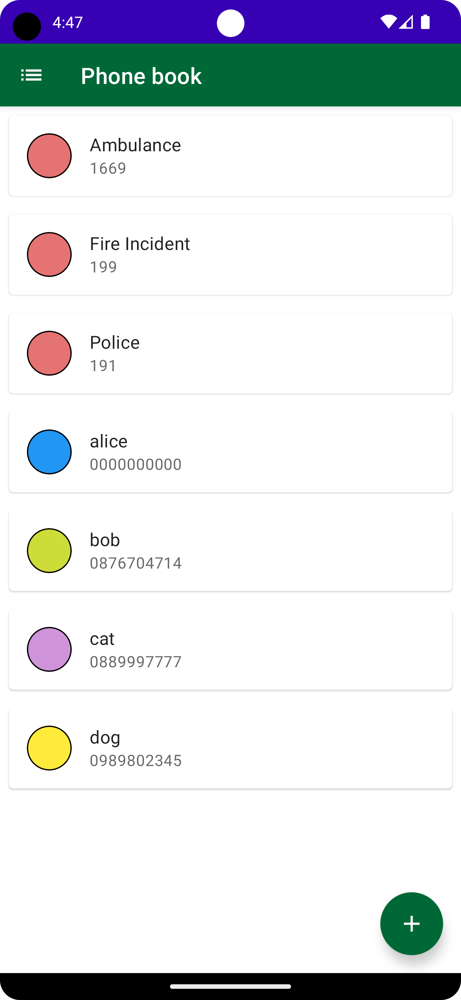
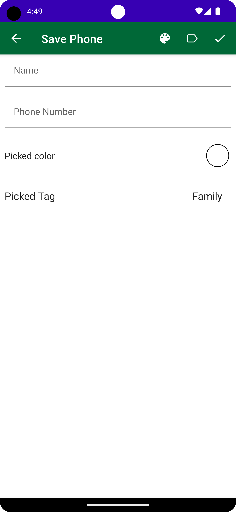
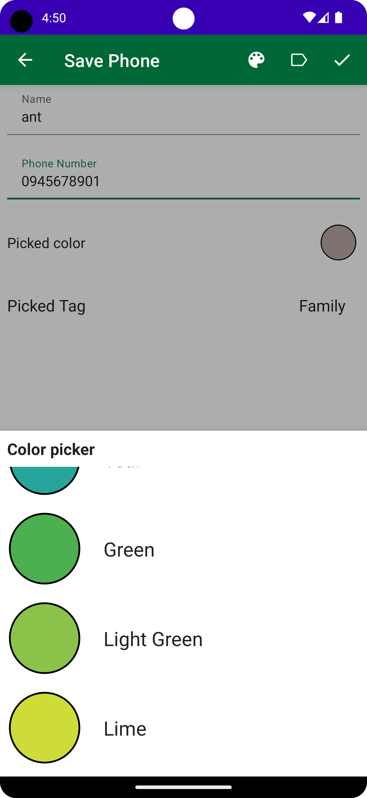
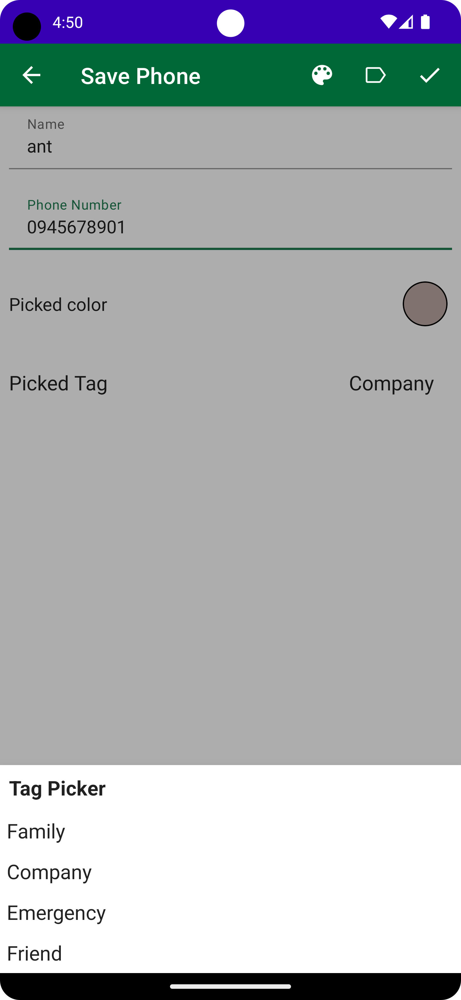
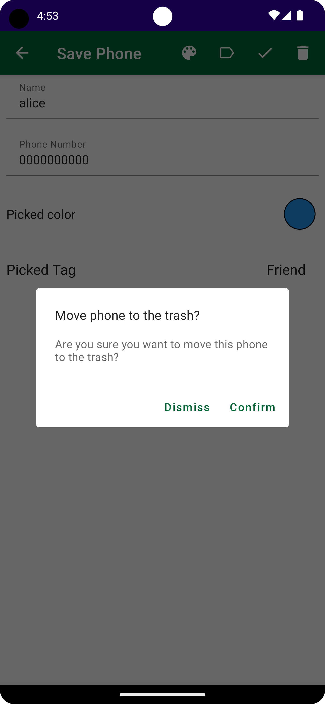
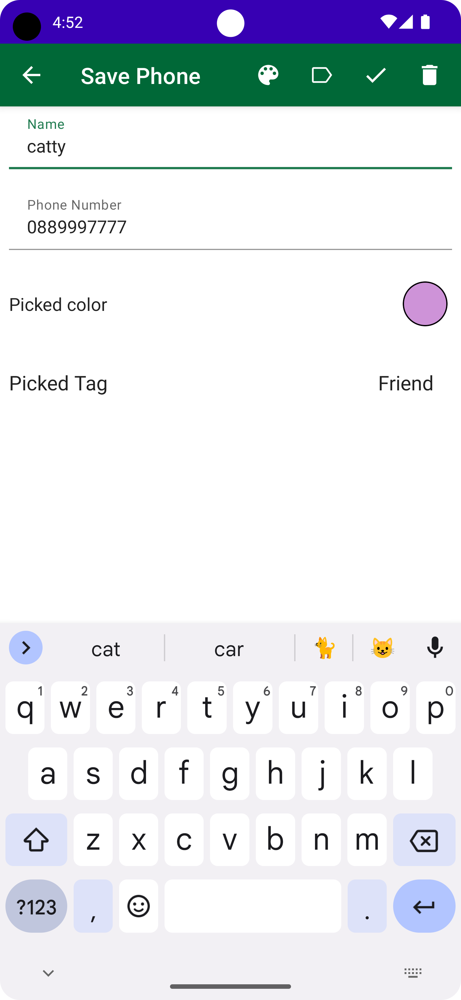
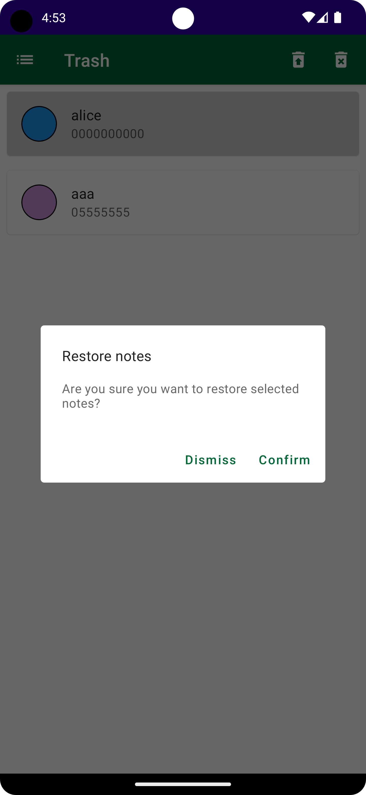
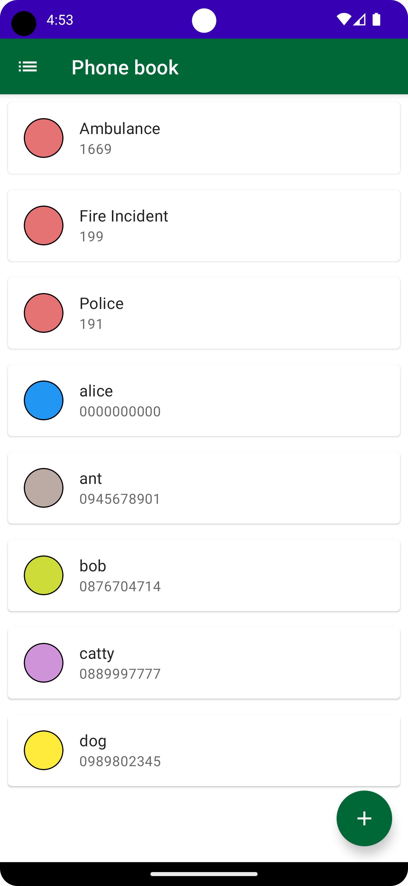

# cn333as5

## โปรแกรมสมุดรวมเบอร์โทรศัพท์ (Android App: PhoneBook)
- สร้างAndroid App: PhoneBook
- สามารถเก็บเบอร์โทรศัพท์และชื่อได้
- สามารถtagไว้เลือกประเภทของเบอร์ได้และเลือกสีได้
- สามารถเพิ่ม, แก้ไข, ลบ และกู้คืนเบอร์โทรศัพท์ได้
- ในหน้าแสดงรายชื่อและเบอร์โทรนั้นจะเรียงตามรายชื่อตัวอักษรโดยที่เบอร์defaultจะอยู่ลำดับต้นก่อนค่อยตามด้วยเบอร์โทรศัพท์อื่นๆ

# รายชื่อ
#### Variya Kittiwattanachok 6310610958

# Demo สาธิตวิธีการใช้งาน
LinkVideo=> [Click_Here](https://youtu.be/KTOUakVouQo)

# ขั้นตอนการใช้งาน
1. git clone https://github.com/6310610958/cn333as5.git
2. Android Studio เลือก file => new => import project => เลือกfileที่cloneไว้
3. กด Run or Shift + F10

# ตัวอย่างโปรแกรม
เมื่อทำการ Run ขึ้นมาจะแสดงหน้าhomeโดยที่เรียงลำดับตามตัวอักษร
(เบอร์defaultจะอยุ๋ลำดับต้นก่อนเบอร์อื่น)

ทำการเพิ่มเบอร์โทรศัพท์

เลือกสีตามที่ต้องการ

เลือกtagหรือหมวดตามต้องการ

ทำการลบเบอร์

ทำการแก้ไขข้อมูล

ทำการกู้คืนเบอร์

home หลังแก้ไขทั้งหมด

